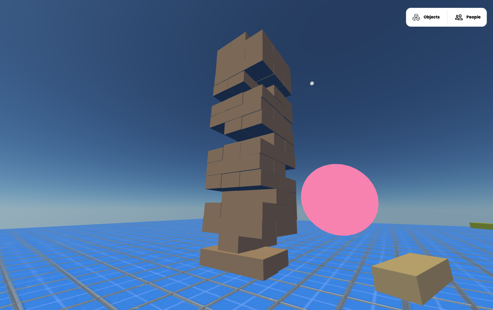

## Jena Component

The Jenga component contains a button that creates an interactive Jenga tower. Pushing the button will create and reset the Jenga blocks to their initial position.

You can demo the project here: [https://aelatgt.link/rfMDfvW](https://aelatgt.link/rfMDfvW) or [http://aelatgt.link/JKHJVgF](http://aelatgt.link/JKHJVgF).

## How to use this repo

1. Create a new project on [Glitch](https://glitch.com/). You may need to enable cross-origin resource sharing, so Hubs can access the scripts on Glitch.
2. Import this repo into the Glitch project. Do this by going to Tools > Import and Export > Import from GitHub and entering `aelatgt/jenga-hubs-component`
3. Add the following custom script URL to hubs: [https://incandescent-psychedelic-spark.glitch.me/rooms/8-interaction-jenga.js](https://incandescent-psychedelic-spark.glitch.me/rooms/8-interaction-jenga.js). But replace `incadescent-psychedelic-spark` with the name of your Glitch project.
4. Refresh the page. You should see a spherical button that appears near the origin. Give it a click!

## Important Files

Instead of trying to clone this repository, you can add the project files to a Glitch project that already exists.

The two most important files are the following:
- `public/rooms/8-interaction-jenga.js` is the file that should be added to Hubs as a custom script.
- `public/components/jenga.js` contains the meat of the Jenga tower creation code.

You can ignore the `public/rooms/6-interaction-click.js` script.

## Future work

Make the Jenga blocks work properly over the network.

## Resources

- [https://github.com/aelatgt/hubs-scripting-guide](https://github.com/aelatgt/hubs-scripting-guide) used to make interactive components in these repo
- [https://github.com/mozilla/hubs/tree/master/src/components](https://github.com/mozilla/hubs/tree/master/src/components) components used in Hubs look identical to custom components
- [https://glitch.com/edit/#!/incandescent-psychedelic-spark](https://glitch.com/edit/#!/incandescent-psychedelic-spark) this project hosted on Glitch

